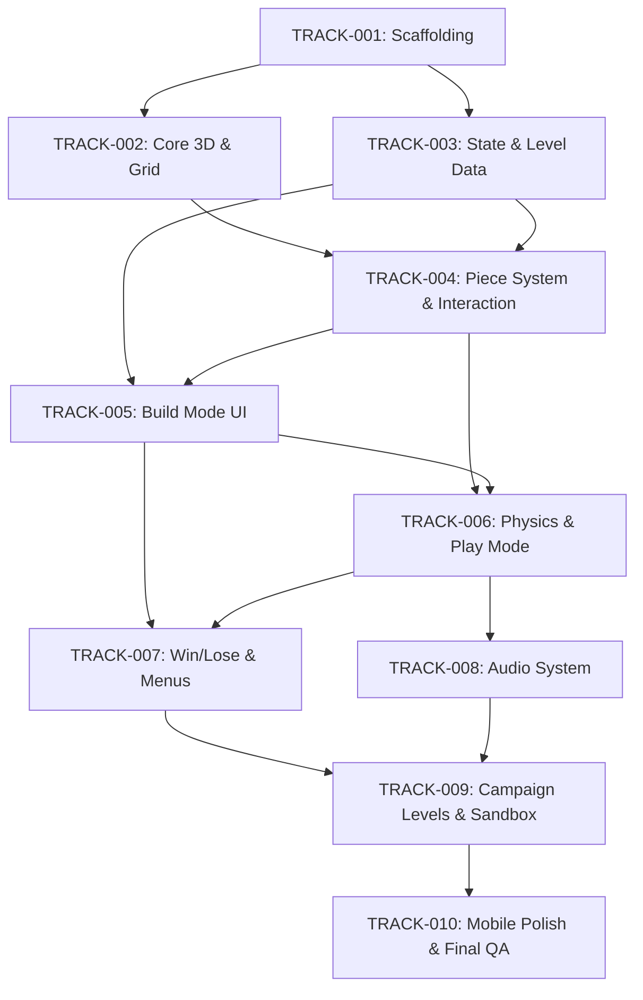

# TumbleGrid — Development Roadmap

> **From scaffolding to MVP.** A sequenced track plan following the Conductor methodology.
>
> Each track is a self-contained unit of work with a clear gate (Core Dependency) that must be
> 100% complete and committed before the next track can begin. Some tracks at the same depth
> can run in parallel.
>
> Campaign and Sandbox are both part of the MVP scope — there is no post-MVP phase.

---

## Track Dependency Graph



> **Parallelism notes:** TRACK-002 and TRACK-003 can run in parallel after TRACK-001.
> TRACK-008 can start alongside TRACK-007 once physics is stable.

---

## TRACK-001: Project Scaffolding

| Field | Value |
|---|---|
| **Track ID** | `TRACK-001` |
| **Status** | Pending |
| **Core Dependency** | None (project seed) |

### Context & Objectives

**User Story:** As a developer, I want a fully configured Vite 8 + React + R3F + Rapier workspace with linting, formatting, testing, and a CI-ready project structure, so that I can write code without tooling friction.

**Scope Boundary:**
- Will: Initialize pnpm workspace, scaffold Vite 8 React-TS, install all core dependencies, configure Biome, Vitest, `tsconfig.json`, `.env.example`, and create the directory skeleton.
- Will NOT: Write any game logic, render any 3D scene, or implement any game feature.

### Architecture & Tech Stack Checklist

- **Languages:** TypeScript 5.x
- **Frameworks:** React 19, Vite 8, Vitest 4
- **Rendering:** Three.js + React Three Fiber (R3F) + @react-three/drei + @react-three/rapier
- **State:** Zustand
- **Quality:** Biome (lint + format)
- **Config files created:** `package.json`, `pnpm-lock.yaml`, `tsconfig.json`, `vite.config.ts`, `biome.json`, `.env.example`, `vitest.config.ts`, `.gitignore`
- **Directory structure created:** `src/` (with subdirectories), `public/`, `tests/`

### Implementation Phase Vectors

- **Phase 1: Init & Install** — `pnpm init`, install all dependencies, verify lockfile integrity.
- **Phase 2: Tooling Configuration** — Biome config, tsconfig paths, Vitest setup with Browser Mode, Vite alias config.
- **Phase 3: Project Skeleton** — Create directory tree (`src/components/`, `src/store/`, `src/levels/`, `src/audio/`, `src/utils/`, `src/hooks/`), stub `main.tsx` and `App.tsx`, verify HMR works with a trivial render.

### Verification Protocols

- **Commands to run:**
  ```bash
  pnpm install --frozen-lockfile
  pnpm run dev          # Vite dev server starts without errors
  pnpm run build        # Production build succeeds
  pnpm run lint         # Biome passes with zero warnings
  pnpm run test         # Vitest runs placeholder test
  ```

- **Expected UI/UX outcome:** Blank white page with "TumbleGrid" title in the browser tab at `localhost:5173`.

### Definition of Done

- [ ] `pnpm install --frozen-lockfile` passes.
- [ ] `pnpm run dev` starts without warnings.
- [ ] `pnpm run build` outputs to `dist/` without errors.
- [ ] `pnpm run lint` exits clean.
- [ ] `pnpm run test` runs and passes a trivial test.
- [ ] All config files are committed to Git.
- [ ] No placeholder text or hardcoded dummy data left in source.
- [ ] Code passes static analysis review.

---

## TRACK-002: Core 3D Scene & Grid System

| Field | Value |
|---|---|
| **Track ID** | `TRACK-002` |
| **Status** | Pending |
| **Core Dependency** | `TRACK-001` |

### Context & Objectives

**User Story:** As a player, I want to see a 3D isometric grid floor with orbitable camera controls when I load the game, so that the spatial puzzle environment is visually established.

**Scope Boundary:**
- Will: Render a Three.js scene via R3F Canvas, display a floor grid plane (10×10 cells matching grid spec), implement OrbitControls with 45°/45° initial angle, pitch clamp (10°–80°), zoom limits (5–50), and auto-framing logic. Will create a `useCamera` hook and a `GridFloor` component.
- Will NOT: Implement piece placement, physics, inventory, or game mode logic.

### Architecture & Tech Stack Checklist

- **Libraries:** `three` (peer dep), `@react-three/fiber`, `@react-three/drei`, `@react-three/rapier`
- **R3F Components:** `<Canvas>`, `<OrbitControls>`, `<Grid>`
- **New files:** `src/components/scene/GridFloor.tsx`, `src/components/scene/GameCanvas.tsx`, `src/hooks/useCamera.ts`
- **Modified files:** `src/App.tsx` (mount GameCanvas)

### Implementation Phase Vectors

- **Phase 1: Canvas & Lighting** — Mount R3F `<Canvas>` with basic ambient + directional lighting. Verify scene renders without errors.
- **Phase 2: Grid Floor** — Implement `GridFloor` using `@react-three/drei`'s `<Grid>` or a custom plane with grid texture. Cell size 2×2 world units. 10×10 cells.
- **Phase 3: Camera System** — `OrbitControls` at 45° pitch / 45° yaw. Clamp pitch [10°, 80°], zoom [5, 50]. Implement `useCamera` hook with `autoFrame(bounds)` that sets `camera.position` and `controls.target` to frame a given grid volume.

### Verification Protocols

- **Commands to run:** `pnpm run dev`
- **Expected UI/UX outcome:** A 3D isometric grid floor fills the viewport. Dragging with right mouse button orbits the camera. Scroll zooms. Pitch cannot flip below the floor. Auto-framing works (test by passing different gridBounds).

### Definition of Done

- [ ] Grid floor renders at correct world scale (2-unit cells).
- [ ] OrbitControls orbit, zoom, and pitch clamp all work.
- [ ] `autoFrame(bounds)` correctly positions camera for any volume.
- [ ] No console errors or Three.js warnings.
- [ ] Code passes static analysis review.

---

## TRACK-003: State Management & Level Data

| Field | Value |
|---|---|
| **Track ID** | `TRACK-003` |
| **Status** | Pending |
| **Core Dependency** | `TRACK-001` |

> Can run in parallel with TRACK-002.

### Context & Objectives

**User Story:** As a developer, I want a central Zustand store that holds the game state machine (BUILDING/PLAYING/LEVEL_CLEARED/CAMPAIGN/SANDBOX variants), level inventory, placed components, and active selection, so that all game systems read from a single source of truth.

**Scope Boundary:**
- Will: Define the Zustand store with all state properties per TDD §3, implement typed actions (placePiece, removePiece, rotatePiece, setMode, transitionState, loadLevel), create the campaign level JSON files and sandbox JSON, write a `loadLevel` action that hydrates state from JSON, and write Vitest schema validation tests.
- Will NOT: Render any 3D objects, build any UI panels, or run physics simulations.

### Architecture & Tech Stack Checklist

- **Libraries:** Zustand, Vitest (schema validation)
- **State shape:** Matches TDD §3 exactly
- **New files:**
  - `src/store/useGameStore.ts` — Zustand store + actions
  - `src/store/types.ts` — TypeScript enums and interfaces (PieceType, GameMode, MachineState, LevelDefinition, etc.)
  - `src/store/actions.ts` — Pure action implementations
  - `src/levels/campaign/01-the-descent.json`
  - `src/levels/campaign/02-the-bank-shot.json`
  - `src/levels/campaign/03-velocity-check.json`
  - `src/levels/campaign/04-the-switchback.json`
  - `src/levels/campaign/05-efficiency-crisis.json`
  - `src/levels/sandbox.json`
  - `src/levels/index.ts` — Typed exports
  - `src/levels/validateLevel.ts` — Runtime schema validator
  - `tests/level-schema.test.ts` — Vitest schema validation tests

### Implementation Phase Vectors

- **Phase 1: Types & Constants** — Define all TypeScript types, enums, and constants (PieceType, MachineState, GameMode, rotationIndex mapping).
- **Phase 2: Zustand Store** — Implement `useGameStore` with all state properties and actions. Write Vitest unit tests for state transitions (place → remove, mode switching, state machine transitions).
- **Phase 3: Level Data & Validation** — Create all 5 campaign JSON files + sandbox JSON. Implement `validateLevel()` with all validation rules from level-data-schema.md §2. Write Vitest tests that validate every level file passes.

### Verification Protocols

- **Commands to run:** `pnpm run test`
- **Expected UI/UX outcome:** All Vitest tests pass (state machine transitions, level data validation, inventory math). The game still renders the blank scene from TRACK-001 — no visible change in the browser yet.

### Definition of Done

- [ ] All Zustand actions implemented and unit-tested.
- [ ] State machine transitions correct (BUILDING ↔ PLAYING → LEVEL_CLEARED, SANDBOX variants).
- [ ] All 5 campaign JSON files + sandbox JSON pass schema validation.
- [ ] Validation rules from §2 of level-data-schema.md enforced in tests.
- [ ] No placeholder text or hardcoded dummy data left in source.
- [ ] Code passes static analysis review.

---

## TRACK-004: Piece System & Interaction (3D Components)

| Field | Value |
|---|---|
| **Track ID** | `TRACK-004` |
| **Status** | Pending |
| **Core Dependency** | `TRACK-002`, `TRACK-003` |

### Context & Objectives

**User Story:** As a player, I want to see 3D representations of all piece types (Launchpad, Straight Ramp, Bumper Pad, Speed Booster, Half-Pipe Tunnel, Goal Bucket) rendered on the grid, and I want to click cells to place them with the correct rotation.

**Scope Boundary:**
- Will: Build R3F mesh components for each piece type, implement raycasting (mouse → floor plane intersection → grid snapping), piece preview (ghost mesh while hovering), placement/removal by clicking, and rotation via R key. Each piece occupies exactly 1 grid cell (2×2×2 world units). Entry/exit face logic is visual only at this stage.
- Will NOT: Activate physics, run simulation, implement trajectory preview, or build inventory UI panels.

### Architecture & Tech Stack Checklist

- **Libraries:** `@react-three/fiber`, `@react-three/drei`, `@react-three/rapier`
- **New files:**
  - `src/components/pieces/StraightRamp.tsx`
  - `src/components/pieces/BumperPad.tsx`
  - `src/components/pieces/SpeedBooster.tsx`
  - `src/components/pieces/HalfPipe.tsx`
  - `src/components/pieces/GoalBucket.tsx`
  - `src/components/pieces/Launchpad.tsx`
  - `src/components/pieces/PieceFactory.tsx` — Type-dispatching wrapper
  - `src/hooks/useGridInteraction.ts` — Raycasting + grid snapping + placement logic
  - `src/hooks/usePieceSelection.ts` — Click-to-select, rotation, removal
  - `src/components/scene/GridGhost.tsx` — Hover preview mesh
- **Modified files:** `src/components/scene/GameCanvas.tsx` (mount pieces from store)

### Implementation Phase Vectors

- **Phase 1: Piece Mesh Components** — Build low-poly 3D meshes for all 6 piece types using R3F primitive geometry (BoxGeometry, CylinderGeometry, etc.). Each occupies 1 grid cell (2×2×2 world units). Visually distinct materials per type.
- **Phase 2: Grid Interaction (Raycasting)** — Implement `useGridInteraction`: cast ray from camera through pointer, intersect floor plane, snap to nearest integer grid cell. Render ghost mesh at hovered cell. On click, call `store.placePiece()`.
- **Phase 3: Selection & Rotation** — Implement `usePieceSelection`: click placed piece to select (highlight), R key cycles rotationIndex (0→1→2→3), click again to remove. Click empty space to deselect. Mesh rotates around Y-axis in 90° increments.

### Verification Protocols

- **Commands to run:** `pnpm run dev`
- **Expected UI/UX outcome:** Grid floor visible. Moving mouse over grid shows a ghost piece at the hovered cell. Clicking places the piece. Clicking placed piece selects it (highlight effect). Pressing R rotates it 90°. Clicking it again removes it. All visual pieces match their GDD descriptions.

### Definition of Done

- [ ] All 6 piece types render as distinct 3D meshes.
- [ ] Raycasting correctly snaps to integer grid coordinates.
- [ ] Place, select, rotate (R key), remove all work.
- [ ] Highlight/selection visual feedback works.
- [ ] Pieces cannot overlap (store prevents it).
- [ ] No console errors.
- [ ] Code passes static analysis review.

---

## TRACK-005: Build Mode UI (Inventory & Controls)

| Field | Value |
|---|---|
| **Track ID** | `TRACK-005` |
| **Status** | Pending |
| **Core Dependency** | `TRACK-003`, `TRACK-004` |

### Context & Objectives

**User Story:** As a player in Build Mode, I want to see my available inventory with remaining counts, select a piece type to place, see the current mode (Build/Play), and have a trajectory preview showing how the marble will flow through my structure.

**Scope Boundary:**
- Will: Build the inventory sidebar/panel (piece type icons + count), add a Play button to start simulation, implement the trajectory preview (dotted polyline from nearest connected piece through hovered piece), build a mode indicator, and add a Stop button placeholder.
- Will NOT: Run physics simulation, handle Play Mode logic (deferred to TRACK-006), or build main menu screens.

### Architecture & Tech Stack Checklist

- **Libraries:** React, Zustand (read store), @react-three/drei (for dotted line rendering)
- **New files:**
  - `src/components/ui/InventoryPanel.tsx` — Piece selector with counts
  - `src/components/ui/ModeToggle.tsx` — Play/Stop buttons
  - `src/components/ui/ModeIndicator.tsx` — Current mode display
  - `src/components/ui/HUD.tsx` — Overlay container for all UI
  - `src/hooks/useTrajectoryPreview.ts` — Waypoint computation + dotted line
  - `src/components/scene/TrajectoryLine.tsx` — R3F dotted polyline renderer
- **Modified files:** `src/App.tsx` (mount HUD), `src/store/useGameStore.ts` (add TrajectoryPreviewCache if needed)

### Implementation Phase Vectors

- **Phase 1: Inventory Panel** — Overlay UI showing each piece type with icon, label, and remaining count (from `store.inventory`). Clicking a piece type sets it as the active blueprint type for placement.
- **Phase 2: Mode Controls** — "Play" button (disabled if no pieces placed? or always enabled). "Stop" button (initially hidden, shown during Play Mode — placeholder logic for now). Visual mode indicator.
- **Phase 3: Trajectory Preview** — On hover, scan placed pieces for nearest connected structure, compute waypoints from exit face → empty cells → hovered entry face → exit face. Render as faint dotted polyline in 3D scene.

### Verification Protocols

- **Commands to run:** `pnpm run dev`
- **Expected UI/UX outcome:** Inventory panel shows correct counts from the loaded level. Clicking a piece type sets the active blueprint. Hovering shows ghost + trajectory dotted line. Play button is clickable. Stop button is visible (placeholder — doesn't transition yet since TRACK-006 handles physics).

### Definition of Done

- [ ] Inventory panel renders with all piece types and counts.
- [ ] Piece type selection works (store `activeBlueprintNode` updated).
- [ ] Play button appears and dispatches the state transition.
- [ ] Stop button visible but inert (wired to store action).
- [ ] Trajectory preview computes and renders dotted line on hover.
- [ ] UI is responsive — scales with viewport.
- [ ] Code passes static analysis review.

---

## TRACK-006: Physics Engine & Play Mode

| Field | Value |
|---|---|
| **Track ID** | `TRACK-006` |
| **Status** | Pending |
| **Core Dependency** | `TRACK-004`, `TRACK-005` |

### Context & Objectives

**User Story:** As a player, I want to press "Play" and watch the marble drop from the launchpad, roll along placed pieces under gravity, bounce off bumper pads, get launched by speed boosters, and fall into the void if my path is incomplete. I want to press "Stop" to return to Build Mode with all pieces preserved.

**Scope Boundary:**
- Will: Implement Rapier physics world (fixed timestep), marble as dynamic rigid body, piece colliders (static kinematic), sensor-based speed booster impulse, bumper bounce (restitution=1.0), goal bucket trigger volume, Play → Build state transition (marble destroy, colliders revert), fail detection (Y < -5), marble roll trail.
- Will NOT: Implement win celebration UI (deferred to TRACK-007), audio (deferred to TRACK-008), or level transitions.

### Architecture & Tech Stack Checklist

- **Libraries:** `@react-three/rapier`, `three` (trail rendering)
- **New files:**
  - `src/components/physics/PhysicsWorld.tsx` — Rapier `<Physics>` wrapper with fixed timestep
  - `src/components/physics/Marble.tsx` — Dynamic sphere rigid body + visual + trail
  - `src/components/physics/PieceCollider.tsx` — Per-piece collider factory (cuboid, sensor, compound)
  - `src/hooks/usePlayLoop.ts` — Play Mode lifecycle (spawn, simulation, stop/reset)
  - `src/hooks/useFailDetector.ts` — Y < -5 detection
- **Modified files:** `src/components/scene/GameCanvas.tsx` (swap collider mode on Play), `src/store/useGameStore.ts` (wire Play/Stop actions)

### Implementation Phase Vectors

- **Phase 1: Physics World & Marble** — Rapier `<Physics>` with fixed timestep and gravity. `<Marble>` as dynamic sphere (radius tuned, restitution ~0.3, friction tuned). Spawns at `launchpadPosition` on Play.
- **Phase 2: Piece Colliders** — Each piece type gets a matching collider:
  - Straight Ramp: tilted cuboid (pitch axis)
  - Bumper Pad: vertical cuboid with restitution=1.0
  - Speed Booster: sensor cuboid that applies impulse on overlap
  - Half-Pipe: compound collider (base plane + two vertical rails)
  - Goal Bucket: sensor trigger volume (invisible interior)
  - Static terrain walls: bumper_pad with restitution=0
- **Phase 3: Play Loop Lifecycle** — `usePlayLoop` manages: on Play → build kinematic colliders from placed pieces, spawn marble, run simulation. On Stop → destroy marble, revert pieces to static, return to Build Mode. On fail (Y < -5) → auto-stop.

### Verification Protocols

- **Commands to run:** `pnpm run dev`
- **Expected UI/UX outcome:** Place pieces, press Play. Marble drops from launchpad, rolls along pieces. Speed booster launches it forward. Bumper pad deflects it. Half-pipe guides it. Marble falls off edge → auto-returns to Build Mode after ~1s. Stop button immediately returns to Build Mode with all pieces preserved. No physics glitches (tunneling, jitter).

### Definition of Done

- [ ] Marble spawns at correct position on Play.
- [ ] Marble rolls along placed pieces under gravity.
- [ ] Speed booster applies impulse on overlap.
- [ ] Bumper pad reflects marble (restitution=1.0).
- [ ] Half-pipe side rails prevent lateral fall-off.
- [ ] Fail detection (Y < -5) triggers auto-stop.
- [ ] Stop button works immediately.
- [ ] All placed pieces preserved on return to Build Mode.
- [ ] No physics warnings or errors in console.
- [ ] Code passes static analysis review.

---

## TRACK-007: Win/Lose Flow, Victory UI & Menus

| Field | Value |
|---|---|
| **Track ID** | `TRACK-007` |
| **Status** | Pending |
| **Core Dependency** | `TRACK-005`, `TRACK-006` |

### Context & Objectives

**User Story:** As a player, when the marble reaches the goal bucket I want a "Level Complete!" celebration, a "Next Level" button, and a "Back to Menu" option. From the main menu I want to choose between Campaign and Sandbox, and within Campaign see a level-select screen.

**Scope Boundary:**
- Will: Implement goal bucket trigger (1.5s dwell → victory state), "Level Complete!" overlay with Next Level / Back to Menu buttons, main menu (Play → Campaign or Sandbox), level-select screen (5 levels, locked/unlocked tracking), campaign progression (next level unlocks on completion), sandbox mode entry. Will use localStorage for progression persistence.
- Will NOT: Build audio for menus (deferred to TRACK-008), implement the sandbox inventory (reuses existing system).

### Architecture & Tech Stack Checklist

- **Libraries:** React, Zustand, localStorage
- **New files:**
  - `src/components/ui/MainMenu.tsx` — Title screen with Campaign / Sandbox buttons
  - `src/components/ui/LevelSelect.tsx` — Grid of 5 level buttons (locked/unlocked)
  - `src/components/ui/VictoryOverlay.tsx` — "Level Complete!" overlay
  - `src/components/ui/LevelIntro.tsx` — Level title + description shown on load
  - `src/hooks/useCampaignProgress.ts` — localStorage read/write for unlocked levels
  - `src/hooks/useGoalDetector.ts` — 1.5s dwell timer tied to store state
- **Modified files:** `src/App.tsx` (route between Menu / LevelSelect / Game), `src/store/useGameStore.ts` (add LEVEL_CLEARED transitions, campaign progress)

### Implementation Phase Vectors

- **Phase 1: Menu Navigation** — Build MainMenu (title + Campaign / Sandbox buttons) and LevelSelect (grid of 5 level cards, locked state greyed out). Wire routing: Menu → LevelSelect → Game. Sandbox button → Game directly in sandbox mode.
- **Phase 2: Victory Detection** — Goal bucket sensor overlap timer. If marble stays inside for 1.5s → set `LEVEL_CLEARED` state. Persist `campaign_XX` as completed in localStorage. Unlock next level.
- **Phase 3: Victory Overlay & Level Intro** — "Level Complete!" overlay with "Next Level" and "Back to Menu" buttons. Level intro overlay showing level title + description on first load.

### Verification Protocols

- **Commands to run:** `pnpm run dev`
- **Expected UI/UX outcome:** App loads to main menu. Click Campaign → level select shows 5 levels (only L1 unlocked). Play L1, guide marble to goal → 1.5s → "Level Complete!" overlay. Click Next Level → loads L2. Click Back to Menu → returns to main menu. Sandbox → loads sandbox with no goal bucket, no win condition.

### Definition of Done

- [ ] Main menu renders with Campaign and Sandbox buttons.
- [ ] Level select shows 5 levels, only unlocked ones are clickable.
- [ ] Goal bucket 1.5s timer triggers victory.
- [ ] "Level Complete!" overlay appears with both buttons.
- [ ] Next Level loads the next campaign level.
- [ ] Campaign progress persists across page reloads.
- [ ] Sandbox mode loads without goal bucket.
- [ ] Code passes static analysis review.

---

## TRACK-008: Audio System

| Field | Value |
|---|---|
| **Track ID** | `TRACK-008` |
| **Status** | Pending |
| **Core Dependency** | `TRACK-006` |

> Can start alongside TRACK-007 once physics is stable.

### Context & Objectives

**User Story:** As a player, I want spatial audio feedback — marble rolling pitch that follows velocity, click sounds for UI interactions, a victory jingle, and a fail tone — all without downloading audio files.

**Scope Boundary:**
- Will: Implement Web Audio API procedural sound synthesis for marble roll (noise source, velocity-pitch mapping, 3D spatialization), UI clicks (short synthesized impulse), victory jingle (rising tone sequence), fail tone (descending tone). Connect to store state (play on state transitions, marble velocity from physics tick).
- Will NOT: Use any audio files, implement background music, or build a volume control UI.

### Architecture & Tech Stack Checklist

- **Libraries:** Web Audio API (native browser API, no external deps)
- **New files:**
  - `src/audio/AudioEngine.ts` — Singleton AudioContext manager, master gain, 3D spatialiser
  - `src/audio/sounds/marbleRoll.ts` — Procedural noise oscillator, pitch follower
  - `src/audio/sounds/uiClick.ts` — Short impulse oscillator
  - `src/audio/sounds/victoryJingle.ts` — Rising tone sequence
  - `src/audio/sounds/failTone.ts` — Descending tone
  - `src/hooks/useAudio.ts` — React hook that subscribes to store + physics state
- **Modified files:** `src/store/useGameStore.ts` (audio is side-effect driven, no store changes needed)

### Implementation Phase Vectors

- **Phase 1: Audio Engine Core** — Singleton `AudioEngine` with lazy `AudioContext` creation (first user interaction unlocks it). Master gain node, stereo panner for spatialisation. Error-tolerant (silent fail if AudioContext unavailable).
- **Phase 2: UI & Event Sounds** — `uiClick` (short sine burst for place/remove/rotate), `victoryJingle` (3-note rising sequence), `failTone` (descending slide). Hook into store via Zustand subscription.
- **Phase 3: Marble Roll (Continuous)** — Connect to physics tick. White noise source through bandpass filter. Pitch mapped to marble velocity (lerped for smoothness). Spatialised to marble's 3D position. Fades in/out on Play/Stop.

### Verification Protocols

- **Commands to run:** `pnpm run dev`
- **Expected UI/UX outcome:** Click a cell → short click sound. Place/remove piece → click. Press Play → marble roll sound starts, pitch rises with speed. Marble hits bumper → brief impact noise. Victory → rising jingle. Fall → descending fail tone. All sounds stop on Stop button.

### Definition of Done

- [ ] AudioContext created on first user interaction.
- [ ] UI click sounds play on place/remove/rotate.
- [ ] Marble roll sound plays during Play Mode, pitch follows velocity.
- [ ] Victory jingle plays on level clear.
- [ ] Fail tone plays when marble falls below Y < -5.
- [ ] All sounds stop immediately on Stop.
- [ ] No errors if AudioContext is blocked or unavailable.
- [ ] Code passes static analysis review.

---

## TRACK-009: Campaign Levels & Sandbox

| Field | Value |
|---|---|
| **Track ID** | `TRACK-009` |
| **Status** | Pending |
| **Core Dependency** | `TRACK-007`, `TRACK-008` |

### Context & Objectives

**User Story:** As a player, I want to play through 5 progressively challenging campaign levels that teach me each mechanic, and freely experiment in Sandbox mode with all pieces available.

**Scope Boundary:**
- Will: Tune all 5 campaign levels for correct physics behavior (verify solution paths work end-to-end), add level-specific static terrain (walls, pillars, pre-placed ramps), verify inventory counts are balanced, test sandbox with full 16-piece inventory, add tutorial hints/descriptions, and run through each level from start to goal. Tune physics parameters (marble mass, friction, restitution, speed booster impulse) for feel.
- Will NOT: Add new piece types, change the core mechanic, or build new UI screens.

### Architecture & Tech Stack Checklist

- **Files modified:**
  - `src/levels/campaign/01-the-descent.json` to `05-efficiency-crisis.json` (fine-tune positions, verify in-engine)
  - `src/levels/sandbox.json` (verify inventory)
  - Physics parameters (marble mass, restitution, friction, speed booster impulse) — constants in `src/components/physics/`
- **New files:**
  - `src/constants/physics.ts` — Tunable physics constants
  - `tests/level-solution.test.ts` — Programmatic validation tests for each level (if feasible with Rapier determinism)

### Implementation Phase Vectors

- **Phase 1: Level-by-Level Verification** — Load each campaign level in-engine. Place the intended solution. Run simulation. Does marble reach goal? Tune positions, tweak ramp/bumper angles, adjust impulse strength. Fix any levels where the solution doesn't work.
- **Phase 2: Physics Tuning** — Play through all 5 levels multiple times. Adjust marble mass, friction, restitution, speed booster impulse, bumper bounce strength until the game feels good. Log tuned constants to `physics.ts`.
- **Phase 3: Sandbox & Edge Cases** — Verify sandbox inventory (16 pieces, all types). Test edge cases: placing pieces at max Y, overlapping rejection, empty inventory, removing all pieces, marathon physics runs.

### Verification Protocols

- **Commands to run:** `pnpm run dev`, load each level and verify
- **Expected UI/UX outcome:** Each campaign level has a valid path to the goal using only its provided inventory. No level has a trivial shortcut or dead-end. Sandbox offers all 16 pieces. Physics feel is consistent across all levels (marble doesn't feel too heavy/light, boosters launch a satisfying distance).

### Definition of Done

- [ ] All 5 campaign levels solvable with provided inventory.
- [ ] No unintended shortcuts (marble can't bypass obstacles).
- [ ] Physics constants tuned and extracted to `physics.ts`.
- [ ] Sandbox inventory matches spec (5 ramps, 4 bumpers, 3 boosters, 4 half-pipes).
- [ ] Edge cases tested (full grid, empty inventory, stacking).
- [ ] Code passes static analysis review.

---

## TRACK-010: Mobile Polish & Final QA

| Field | Value |
|---|---|
| **Track ID** | `TRACK-010` |
| **Status** | Pending |
| **Core Dependency** | `TRACK-009` |

### Context & Objectives

**User Story:** As a mobile player, I want to play TumbleGrid on my phone/tablet with touch controls, pinch-to-zoom, and a responsive layout that fits my screen.

**Scope Boundary:**
- Will: Implement touch input normalization (pointer events → raycasting), two-finger twist for rotation, pinch-to-zoom on OrbitControls, responsive UI (inventory panel adapts to narrow screens), larger touch targets for all buttons, safe area handling, viewport meta tag. Run cross-browser final QA (Chrome, Firefox, Safari, Edge).
- Will NOT: Add new game features, change desktop controls, or implement progressive web app (PWA) support.

### Architecture & Tech Stack Checklist

- **Libraries:** Pointer Events API (native), CSS Media Queries, viewport-fit for safe areas
- **New files:**
  - `src/hooks/useTouchRotation.ts` — Two-finger twist gesture → rotationIndex
  - `src/utils/input/normalizePointer.ts` — Pointer, touch, mouse → unified `{ x, y, button, isTouch }`
  - `src/styles/mobile.css` — Mobile-specific responsive overrides
- **Modified files:**
  - `src/hooks/useGridInteraction.ts` — Use normalized pointer input
  - `src/components/ui/InventoryPanel.tsx` — Responsive layout (collapsible on mobile)
  - `index.html` — Viewport meta tag, safe-area CSS env vars
  - `src/components/scene/GameCanvas.tsx` — Touch gesture bindings
  - `src/components/ui/HUD.tsx` — Responsive positioning

### Implementation Phase Vectors

- **Phase 1: Touch Input Pipeline** — Normalize all pointer/touch/mouse events into a single `{ x, y, button, isTouch }` format. Feed into existing raycasting and interaction hooks. Verify tap-to-place, tap-to-select work on touch devices.
- **Phase 2: Touch Gestures** — Implement two-finger twist (track two touch points, compute angle delta → cycle rotationIndex). Verify pinch-to-zoom works with OrbitControls (may need damping tuning). Ensure single-finger drag orbits correctly.
- **Phase 3: Responsive UI & Final QA** — Inventory panel collapses/shrinks on narrow viewports. Button touch targets ≥ 44px. Safe area insets for notched devices. Cross-browser testing. Fix any layout or input bugs.

### Verification Protocols

- **Commands to run:** `pnpm run dev` (test in Chrome DevTools mobile emulation + real device)
- **Expected UI/UX outcome:** On mobile viewport (375×667): inventory panel is compact but usable. Tap places pieces. Tap-to-select works. Two-finger twist rotates piece. Pinch zooms. All buttons have adequate touch targets. On desktop: everything still works exactly as before (no regression).

### Definition of Done

- [ ] Tap-to-place and tap-to-select work on touch devices.
- [ ] Two-finger twist gesture rotates the selected piece.
- [ ] Pinch-to-zoom works comfortably.
- [ ] All interactive elements have ≥ 44px touch targets.
- [ ] Safe area insets applied for notched devices.
- [ ] Inventory panel is usable on 375px-wide screens.
- [ ] Desktop controls have zero regression.
- [ ] Cross-browser test passes (Chrome, Firefox, Safari, Edge).
- [ ] Code passes static analysis review.

---

## Summary

| Track | ID | Depends On | Est. Output |
|---|---|---|---|
| Scaffolding | TRACK-001 | — | Tooled workspace |
| Core 3D & Grid | TRACK-002 | TRACK-001 | 3D scene + camera |
| State & Level Data | TRACK-003 | TRACK-001 | Store + level JSON + validation |
| Piece System | TRACK-004 | TRACK-002, TRACK-003 | 3D pieces + placement |
| Build Mode UI | TRACK-005 | TRACK-003, TRACK-004 | Inventory + HUD + trajectory |
| Physics & Play Mode | TRACK-006 | TRACK-004, TRACK-005 | Marble + simulation + fail |
| Win/Lose & Menus | TRACK-007 | TRACK-005, TRACK-006 | Menus + victory + progression |
| Audio System | TRACK-008 | TRACK-006 | Procedural sounds |
| Campaign & Sandbox | TRACK-009 | TRACK-007, TRACK-008 | 5 tuned levels + sandbox |
| Mobile Polish & QA | TRACK-010 | TRACK-009 | Touch controls + responsive |
